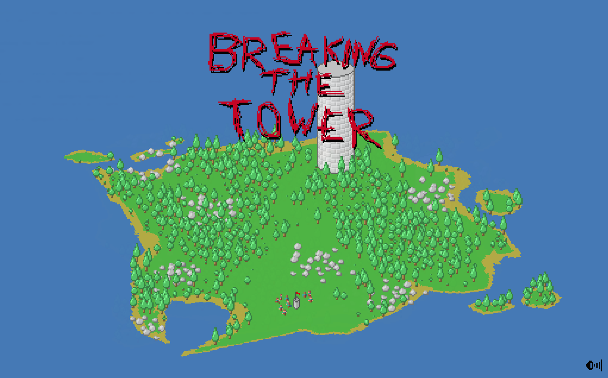

# Breaking the Tower

A modernized version of [Notch's](https://en.wikipedia.org/wiki/Markus_Persson) classic Java applet game "Breaking the Tower" - an RTS/god game where players command peons to gather resources, build structures, and ultimately destroy a central tower.



## About

This is a fork of the original Breaking the Tower game, updated from Java 1.6 to modern Java 21 with significant architectural improvements while preserving the original gameplay experience.

## Changes from Original

### Architecture Modernization

- **Java 21 Syntax**: Records, sealed classes, pattern matching, switch expressions
- **EventBus Pattern**: Decoupled sound and effect handling (no more hardcoded `Sounds.play()` calls in entities)
- **ServiceLocator Pattern**: Testable service access throughout the codebase
- **State Pattern**: Explicit game state management (Title/Playing/Won) replacing boolean flags
- **Sealed Hierarchies**: Entity types (9) and Job types (6) use sealed classes for exhaustive pattern matching

### Pathfinding System (New in v2)

- **A\* Pathfinding**: Peons now intelligently navigate around obstacles instead of bumping into them repeatedly
- **8-Directional Movement**: Diagonal movement support with proper cost calculation
- **Deterministic Algorithm**: Integer costs (10/14) and ordered data structures ensure reproducible behavior
- **Unreachable Detection**: Targets that can't be reached are immediately abandoned (replaces random 10% abandon chance)
- **Blacklist System**: 60-tick cooldown prevents peons from repeatedly attempting unreachable targets

### Code Quality

- **MovementSystem**: Single source of truth for entity movement, separated from behavior logic
- **NavigationGrid Interface**: Clean abstraction for world queries
- **Golden Master Testing**: 5000-tick deterministic test validates behavior preservation
- **~5,300 lines of Java**: Clean, maintainable codebase

## Building & Running

### Prerequisites

**Java 21+** and **Maven** are required.

#### Installing Java 21

**Linux (Debian/Ubuntu):**
```bash
sudo apt install openjdk-21-jdk
```

**Linux (Arch):**
```bash
sudo pacman -S jdk21-openjdk
```

**macOS (Homebrew):**
```bash
brew install openjdk@21
```

**Windows:**
Download from [Adoptium](https://adoptium.net/) or [Oracle](https://www.oracle.com/java/technologies/downloads/)

Verify installation:
```bash
java -version
```

#### Installing Maven

**Linux (Debian/Ubuntu):**
```bash
sudo apt install maven
```

**Linux (Arch):**
```bash
sudo pacman -S maven
```

**macOS (Homebrew):**
```bash
brew install maven
```

**Windows:**
Download from [Apache Maven](https://maven.apache.org/download.cgi) and add to PATH

Verify installation:
```bash
mvn -version
```

### Build

```bash
mvn clean package
```

### Run

```bash
java -jar target/tower-1.0-SNAPSHOT.jar
```

Or compile and run directly:
```bash
mvn compile exec:java -Dexec.mainClass=com.mojang.tower.TowerComponent
```

## How to Play

- Command your peons to gather resources (wood, rock, food)
- Build structures to expand your capabilities
- Train warriors to fight monsters
- Destroy the tower to win

## Tech Stack

- Java 21
- Maven
- AWT/Java2D (rendering)
- JUnit 5 (testing)

## Credits

Original game by **Notch** (Markus Persson) - creator of Minecraft. This was a Ludum Dare style game from the Java applet era.

## License

This is a fan modernization of the original game for educational purposes.
